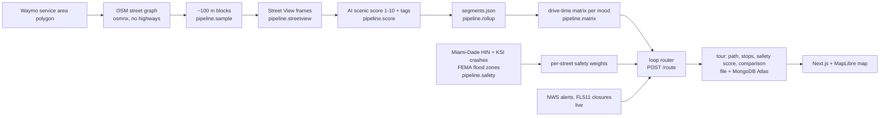

# Waymo Haven

**An idle robotaxi becomes a tour guide that knows which streets are beautiful and which are dangerous.**

Pick a mood (street art, waterfront, food...) and a time budget. Waymo Haven plans a loop through the most scenic blocks
of Miami that fits the time. With **Safer Route**, it keeps the ride off the county's High Injury Network and big
arterials, and shows you exactly what it avoided. A multilingual voice narrates the ride.

Built at ShellHacks 2026. Live demo: TODO(team): https://... · Demo video: TODO(team): https://...


## What it does

- **Scenic loop tours.** About 10,700 Google Street View frames were taken along Miami streets in and around Waymo's
  service area. Each ~100 m block is rated 1-10 for what a passenger would enjoy out the window and tagged
  (mural, waterfront, art deco, historic, food, greenery) by TODO(team: the model that scored the current data).
  2,818 blocks are scored. The router builds a loop through the best blocks for your mood that fits your
  10-30 minute budget and returns to where you started. Skip through up to 10 ranked alternatives, or click a
  destination for a one-way ride.
- **Two ways to pick the scenery.** *Street View AI* uses the photo scores above. *Popular online* ranks every street in
  the service area by the places people map and read about: 1,053 OpenStreetMap attractions, museums, galleries,
  murals, monuments, parks, marinas and restaurants, weighted by their Wikipedia readership
  (`Server/pipeline/popular.py`, free, no keys). It needs no photos, so tours start from Wynwood, Little Havana,
  Downtown, Brickell, the Design District, Coconut Grove or Coral Gables.
- **Safer Route (the "most trusted driver" part).** Every street is weighted with Miami-Dade County's own crash data:
  High Injury Network corridors, every killed-or-seriously-injured crash since 2019, lane count and speed, FEMA flood
  zones (only while the National Weather Service has a flood alert out), and live FL511 road closures when a key is
  configured. Every tour gets an explainable 0-100 safety score, and a Safer tour is compared with the same request
  with Safer Route off: the kilometres of high-injury road avoided, the corridors by name, and the minutes it costs.
- **Narration.** A spoken intro in English, Spanish or Portuguese (ElevenLabs `eleven_multilingual_v2`), cached in
  MongoDB Atlas so each clip is paid for once.
- **The map.** Scenic heat map, High Injury Network corridors, serious and fatal crash sites, flood zones, and the
  Street View photo behind every block (click a street).

## How it works



**Routing.** For each mood, the top 60 scored blocks and the drive minutes between every pair are precomputed with
Dijkstra on the OSM graph (`Server/pipeline/matrix.py`). A request inserts blocks into a loop from the start by
*best score per added minute* until the budget is used (`Server/app/router.py`). It then drops out-and-back spurs,
drives each block in whichever direction makes the loop shortest, and returns to the start (`Server/app/tour.py`).
Ranked alternatives are built around different "anchor" blocks at least 500 m apart.

**Safer Route.** Between stops the road is chosen on `safe_time` instead of `travel_time`
(`Server/app/safety.py`):

```
safe_time = travel_time × (1 + 1.0·HIN + min(1, 0.2·KSI crashes) + 0.4·arterial − 0.1·calm street
                           [+ 1.0·flood zone during an NWS flood alert] [+ 9 on a live closure])
```

A candidate stop on a High Injury corridor keeps 60% of its scenic score, so the tour prefers murals on calmer
streets. The 0-100 score is `100 − 45·(share of km on HIN) − 25·min(1, crash rate ÷ (4 × service-area average))
− 20·(share on arterials) − 10·(share in flood zones during an alert) − 15 if it crosses a closure`.

**Storage.** Tours are JSON files mirrored to MongoDB Atlas (`Server/app/store.py`). Reads go to the local file first,
and a Mongo outage only skips the mirror, so the demo never depends on the network. Narration audio is cached in
Atlas keyed by a hash of (text, voice, language, model).

## Data

| Source | What we use | Size |
|---|---|---|
| Waymo's published Miami launch map | service area, traced by hand (~50 m accuracy, approximate, not official) | 54 sq mi |
| OpenStreetMap (osmnx) | drivable street graph, speed limits, lanes | |
| Google Street View Static API | one frame per ~100 m block | ~10,700 frames |
| Miami-Dade County Vision Zero, High Injury Network | corridors with the most fatal and serious-injury crashes | 15 corridors |
| FDOT Signal Four via Miami-Dade open data | killed-or-seriously-injured crashes 2019-2025 | 2,641 (1,985 inside the service area) |
| FEMA National Flood Hazard Layer | special flood hazard areas | 198 polygons |
| National Weather Service (api.weather.gov) | active alerts, live | |
| FL511 | closures and incidents, live (optional key) | |

Deliberately **not** crime data: it says nothing about the safety of a locked robotaxi's passengers and would steer
tours away from neighborhoods rather than from dangerous roads.

## Run it

Backend (Python 3.11+), from `WaymoMapProject-main/Server`:

```powershell
python -m venv .venv
.venv\Scripts\Activate.ps1
pip install -r requirements.txt
copy .env.example .env        # keys are optional for browsing; see the comments in the file
uvicorn app.main:app --port 8000
```

Frontend (Node 20+), from `WaymoMapProject-main/client`:

```powershell
npm install
npm run dev                   # http://localhost:3000; set NEXT_PUBLIC_API_URL if the API is not on localhost:8000
```

`client/.env.local` holds `ELEVENLABS_API_KEY` (and optional `ELEVENLABS_VOICE_ID`, `MONGO_URI`) for the narration route.
Deployment (DigitalOcean droplet + Caddy + Vercel): see [`WaymoMapProject-main/DIGITALOCEAN.md`](WaymoMapProject-main/DIGITALOCEAN.md).
Pipeline and API details: [`WaymoMapProject-main/Server/README.md`](WaymoMapProject-main/Server/README.md).

## Honest limits

- The service area is traced from Waymo's public map; it is approximate and not official.
- Scenic scores are an AI model's opinion of one photo per block, not ground truth.
- Drive times are OSM speed limits × 0.8, not calibrated against real rides.
- Tours start in Wynwood or at any photographed street you click.
- Safer Route reliably cuts driving on High Injury corridors. It can still pass some crash sites, and it changes which
  stops are chosen, so the comparison is "the same request with Safer Route off", not the same streets.

## Credits

Street data © OpenStreetMap contributors (ODbL). Basemap © CARTO. Street View imagery © Google. Crash and High Injury
Network data: Miami-Dade County / FDOT Signal Four. Flood zones: FEMA. Weather alerts: NOAA/NWS. Voice: ElevenLabs.

Team: TODO(team): names and GitHub handles.
